<p align="center">
  
</p>

# Design of 4X4 SRAM Memory Array Using Cadence Virtuoso
### About :

This is a project report submitted by Vardhan Suroshi to Prof. Mahesh Awati, Department of Electronics and Communication Engineering PES UNIVERSITY in the 6th semester for the course "Memory Design and Testing" (Course Code: UE20EC343) during the academic year 2022-23 The project involves the design of a 4X4 SRAM Memory Array using Cadence Virtuoso built using GPDK 180nm

**Project guide:**
Prof. Mahesh Awati,
Department of Electronics and Communication Engineering, PES UNIVERSITY,
Electronic City, Bangalore-560100,
Jan-March 2023
## Table of Contents

- [Design of 4X4 SRAM Memory Array Using Cadence Virtuoso](#design-of-4x4-sram-memory-array-using-cadence-virtuoso)
- [Implementation and Simulation Results](#implementation-and-simulation-results)
  - [Write Operation](#write-operation)
    - [Write '0' Operation](#write-0-operation)
    - [Write '1' Operation](#write-1-operation)
  - [Read Operation](#read-operation)
    - [Read '1' Operation](#read-1-operation)
    - [Read '0' Operation](#read-0-operation)
  - [Stability of SRAM Cell](#stability-of-sram-cell)
    - [Hold State](#hold-state)
    - [Read State](#read-state)
- [6T SRAM Cell](#6t-sram-cell)
  - [Pre-charge Circuit](#1-pre-charge-circuit)
  - [Isolation Circuit](#2-isolation-circuit)
  - [Sense Amplifier](#3-sense-amplifier)
  - [Write Driver Circuit](#4-write-driver-circuit)
  - [SRAM Cell along with all the Peripheral Devices](#5-sram-cell-along-with-all-the-peripheral-devices)
- [4x4 Memory Array](#4x4-memory-array)
- [Conclusion](#conclusion)
- [Acknowledgment](#acknowledgment)


## 1.1 Introduction :


<p align="center">
  
</p>


In modern computer systems, various types of memory are employed to store and manage data. These memories can be broadly categorized into the following category 


<p align="center">
  
</p>

### Volatile Memory

Volatile memory is temporary storage that loses its contents when the power is turned off. The primary volatile memory types include RAM. RAM is a fast, volatile memory used for temporary data storage. It allows quick read-and-write access, making it essential for active applications and the operating system.
There are mainly two kinds of RAM:

1. **Dynamic Random Access Memory (DRAM):** DRAM is a type of RAM that stores each bit of data in a separate capacitor within an integrated circuit. It requires periodic refresh cycles to maintain data integrity.

2. **Static Random Access Memory (SRAM):** SRAM is another form of volatile memory that does not require refreshing. It is often used for cache memory in CPUs due to its faster access times compared to DRAM.

### Non-volatile Memory

Non-volatile memory retains its data even when power is turned off. Common types of non-volatile memory include:

1. **Read-Only Memory (ROM):** ROM is used to store permanent data, typically in firmware and software. It is non-volatile and is not easily modified.

2. **Flash Memory:** Flash memory is a type of non-volatile storage that can be electrically erased and reprogrammed. It is commonly used in USB drives, SSDs, and memory cards.


## Static Random Access Memory (SRAM)

SRAM is a type of volatile memory that uses bistable latching circuitry to store each bit. Unlike DRAM, SRAM does not require refreshing, making it faster and more energy-efficient. SRAM cells offer an advantage over other types of volatile memory, such as Dynamic Random Access Memory (DRAM), which is slower and requires periodic refresh cycles. This makes SRAM cells a fundamental building block of modern computing systems and a key technology for achieving high-speed data processing.


### Applications of SRAM

SRAM is widely used in various applications due to its speed, low power consumption, and suitability for cache memory. Some key applications include:

1. **Cache Memory:** SRAM is commonly used as cache memory in CPUs to provide fast access to frequently used data.

2. **Register Files:** SRAM is used in register files within microprocessors for storing temporary data during computation.

3. **Networking Devices:** SRAM is employed in networking devices for buffering and storing routing tables.

4. **Embedded Systems:** SRAM finds applications in embedded systems, providing quick access to critical data.


## Project Objectives
The primary objective of this project is to gain a comprehensive understanding of Static Random Access Memory (SRAM) by designing a complete 6T SRAM cell, including its peripheral circuitry, using Cadence tools on the 180nm technology node (GPDK180). The project aims to explore various aspects of SRAM design with a focus on optimizing read and write stability, transistor sizing for enhanced data stability, and the design of peripheral circuits to achieve faster read and write operations


The project aims not only to achieve the defined objectives but also to foster a collaborative environment for knowledge sharing and continuous improvements. Feel free to explore the repository, contribute, raise issues, and engage in discussions as we work together to achieve the project goals.


# SRAM Memory Architecture


<p align="center">
  
</p>


---------------------------------------- work in progress ---------------------------------------------------

<div style="display: flex; justify-content: space-between; align-items: center;">
    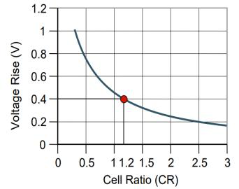
    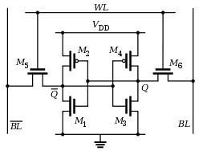
</div>


**The two basic requirements which dictate the W/L ratios are:**\
a) **Read upset:** The data-read operation should not destroy the
stored information in the SRAM cell.
The cell ratio (beta) should be less than 1.5 to for the proper functioning of SRAM cell 
b) **Write upset**:The cell should allow the modification of the stored information during the data-write phase.

 These conflicting requirements for read and write operations are satisfied by sizing the bit cell transistors to provide stable read and write operations.

 To satisfy requirement (a), we come up with the cell ratio, β for the read operation which is given by,

```
 Cell ratio,β ={ (W\L) pull down transistors } / {(W\L) access transistor} 
```
To satisfy requirement (b), we come up with the pull-up ratio, PR for
the write operation which is given by,
```
Pull-up ratio, P.R ={ (W\L) pull up transistors } / {(W\L) access transistor } 
```
## Implementation and Simulation Results 


 **1. We have implemented a 6T SRAM with CR=1.25 and PR=0.85 using
180nm technology by keeping the length of all devices at 180nm. We
 verified the Read and Write operation and also plotted the Butterfly
 curve for Hold state and Read state.**

Circuit diagram of SRAM cell :
<p align="center">
  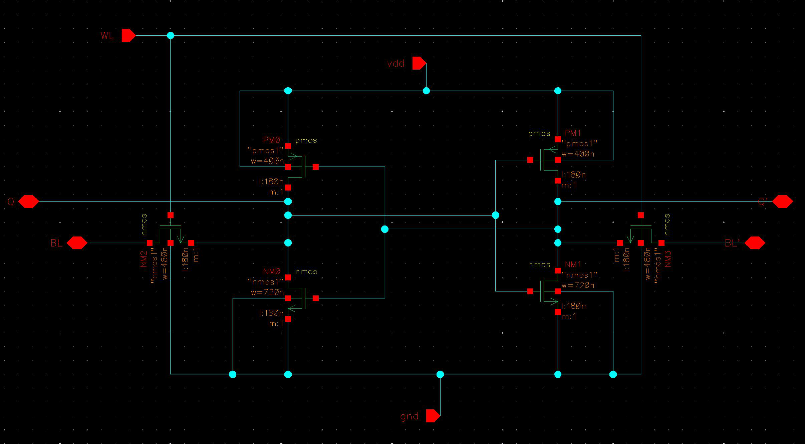
</p>

(Width of pull-up transistors Wp= 400nm,
Width of access transistors Wa= 470nm,
Width of pulldown transistors Wn= 590nm)

## 2. Write operation :

+ Initially word line WL is high and hence bit lines BL and Bl' are
connected to the SRAM cell.

+ The write driver circuit provides the required voltage to BL and
BL' ( For write 0, BL = 0, BL' = 1 and for write 1, BL=1, BL' = 0).

+ The corresponding data will be then written into the cell (Q = 0 for
write 0 and Q = 1 for write 1).

For a successful write operation, access transistors should be stronger
than the pull-up transistors which are taken care of by the pull-up ratio.

### 2.1 Write '0' operation

Now let us consider writing a "0" to a cell that is storing a "1".

+ The write driver makes BL=0V and BL'= VDD as '0' is written into the
cell.

+ Now the address decoder makes WL=1.

+ Q' side of the cell cannot be pulled high enough to ensure the writing
of '1' due to sizing constraint

+ imposed by the read stability. It ensures that this voltage is kept
below 0.4V.

+ Hence the new value of the cell has to be written through the transistor
M6 . Data '0' will be written into the cell if node Q is pulled down, below the threshold voltage of M1 to  turn it OFF


 Schematic for Write 0 Operation :
 <p align="center">
  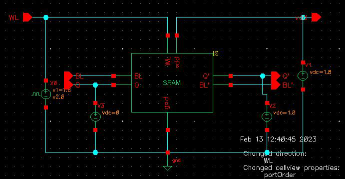
</p>


Timing diagram for Write '0' :
<p align="center">
  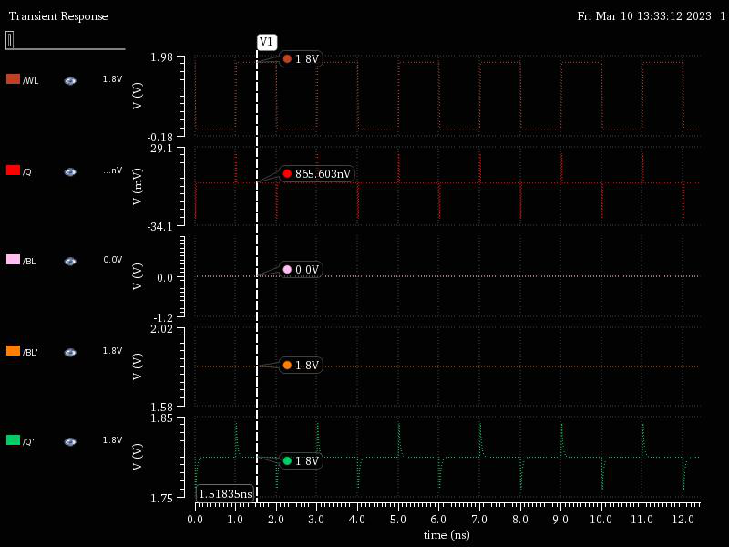
</p>


### 2.2 Write '1' operation

schematic :
<p align="center">
  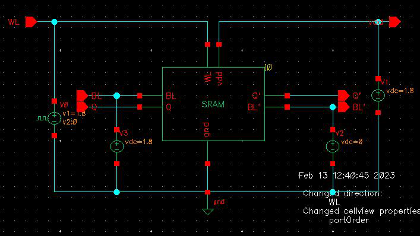
</p>


Timing diagram for Write '1'

<p align="center">
  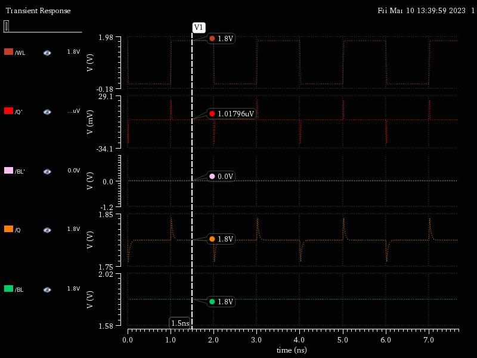
</p>


## 3. Read operation
+ To perform a read operation, the memory cell should have some value.
Consider, that '1' is stored in the memory cell (Q =1 and Q' = 0).

+ Initially the bit lines BL and BL' are pre-charged to Vdd. Then the
word line WL is made high. So the transistors M1, M4, M5 and M6 (From
Fig 1) will turn ON.

+Therefore BL' gets discharged through the series transistors M5-M1 and
BL will remain in its pre-charged state.

+ As the difference between the two-bit lines builds up, the sense
amplifier is activated which gives output i.e. '1' is read from the
memory cell.

### Read '1' operation :
schematic Read 1 operation :


<p align="center">
  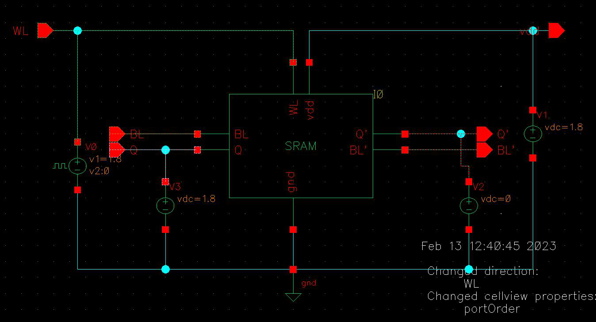
</p>


Timing diagram for Read '1'

<p align="center">
  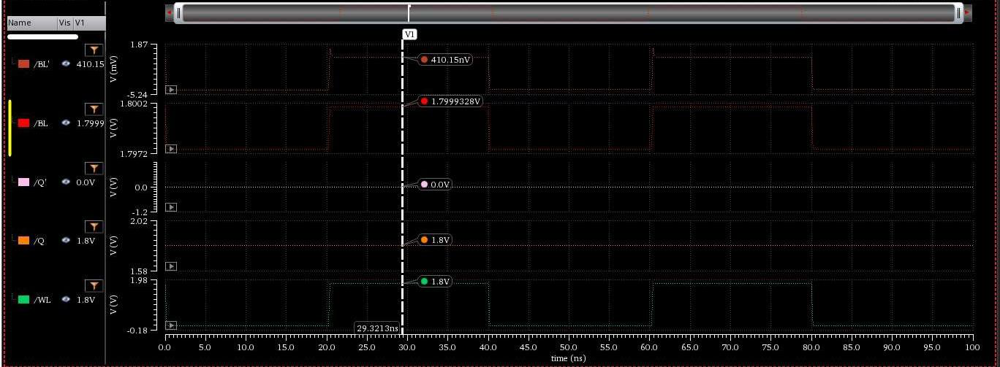
</p>


### Read '0' operation
schematic : 
<p align="center">
  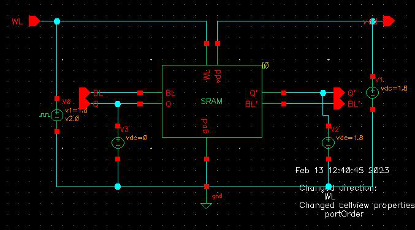
</p>


Timing diagram for Read '0'
 <p align="center">
  
</p>
 
## 4. Stability of SRAM cell**

The stability of the SRAM cell can be described by the 'Butterfly curve' which is obtained by superimposing the voltage transfer curves (VTC) of the two inverters of the memory cell. The stability of the SRAM cell can be analyzed by measuring the Static Noise Margin (SNM). SNM is the measure of the stability of the SRAM cell to hold its data against noise. The Stability of the cell is given by the size of the maximum square box that can fit inside the Butterfly wing.

Butterfly curve for SRAM Cell :
<p align="center">
  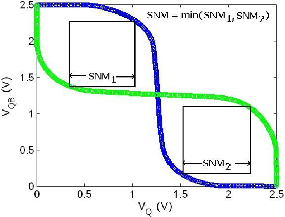
</p>


Butterfly plot for read stability :

<p align="center">
  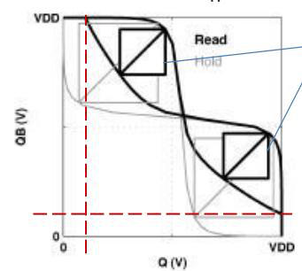
</p>

### Hold state


<p align="center">
  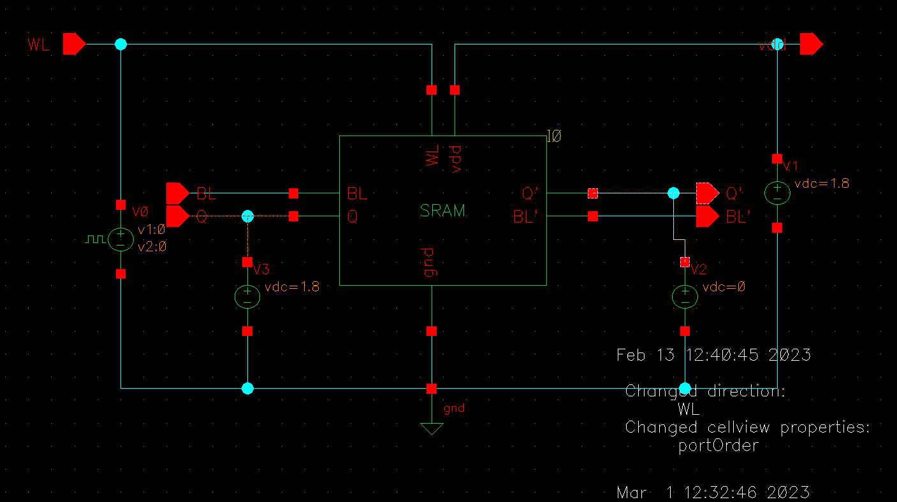
</p>


Butterfly curve for Hold state: 
<p align="center">
  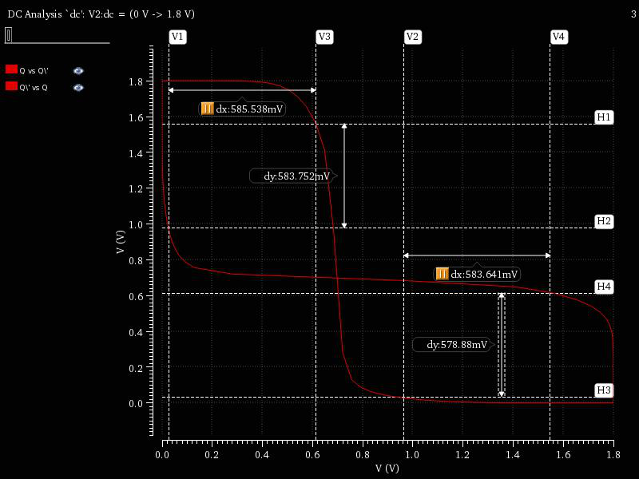
</p>


WL = 0 and hence access transistors are OFF. Therefore, the cell is isolated from BL and BL' and hence there is no possibility of state changing since there will be less noise getting added. Since there is no noise getting added, the inverters are working with the perfect VTC and hence Hold state Static noise margin is expected to be maximum.
```
 SNM = min (max(SNM1),max( SNM2) )
= min (578.869mV, 585.075mV)
= 578.869mV**
```
### Read state


<p align="center">
  
</p>


Butterfly curve for Read state


<p align="center">
  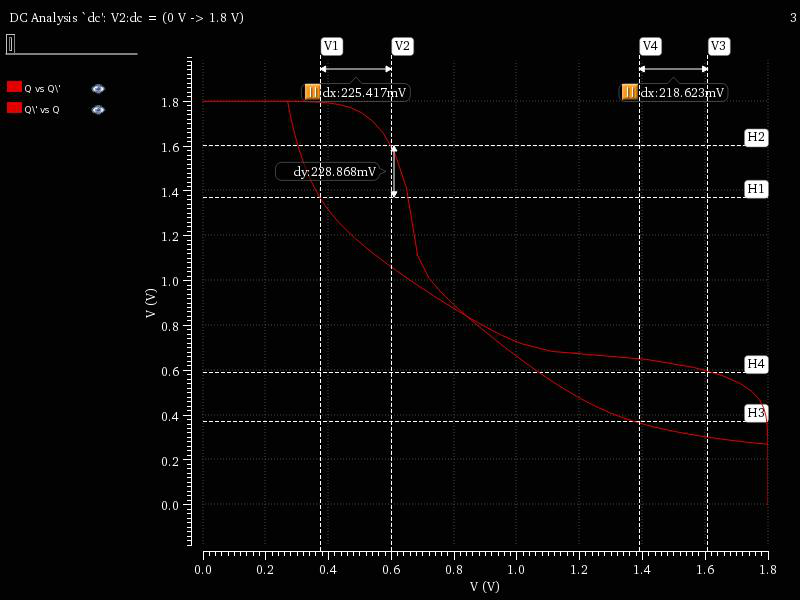
</p>


WL = 1 and hence access transistors are ON. Therefore, the cell is connected to BL and BL' and hence there is a possibility of noise getting added. Therefore, the curve flattens during the read operation hence reducing the box size. Hence, the stability is reduced.
```
 SNM = min (max(SNM1),max( SNM2) )
 = min (225.417mV, 218.623mV)
 = 218.623 mV
```
**2. We have designed a pre-charge circuit to charge a BL and BL' with capacitance of 120f in 0.5n Seconds**

<p align="center">
  
</p>

Pre-charge circuit (Width of the transistors = 12um) :
<p align="center">
  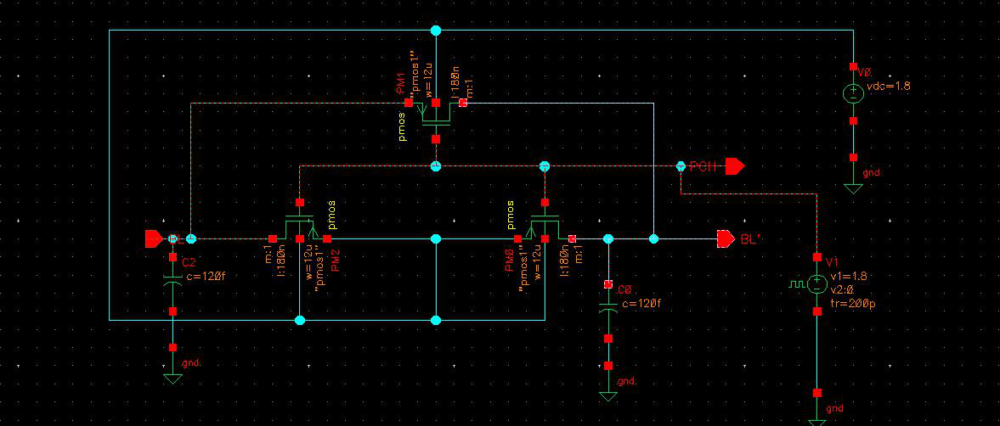
</p>

Timing diagram :
<p align="center">
  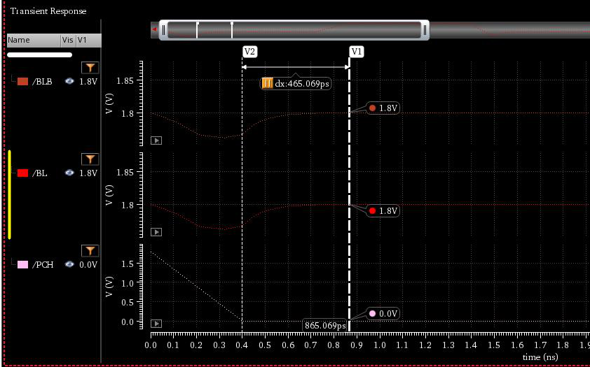
</p>


**3. We have designed a 6T SRAM cell with the following specifications. External capacitance of 120fF is connected to BL and BL' to account for the parasitic capacitance of BL and BL'**
```
+--------------------------------+-----------------------------------+
|  **Length of all MOS**           | **180nm**                       |
+=================================+===================================+
| **Width of PMOS devices (wp)**  |  **Minimum width**               |
+--------------------------------+-----------------------------------+
|  **Access transistors width      | **1.2 x wp**                    |
|  (wa)**                          |                                 |
+---------------------------------+-----------------------------------+
| **Width of Pull down NMOS       |  **1.5 x wa**                    |
|  transistors (wn)**             |                                  |
+-----------------------------------+--------------------------------+
```
**We have also designed the peripheral circuits -- Pre-charge circuit, Isolation circuit, Sense Amplifier and Write driver circuit We have also performed the simulation of Read and Write operation**

## 6T SRAM Cell

Circuit diagram of 6T SRAM cell (Width of pull-up transistors = 400nm, Width of access transistors = 480nm, Width of pull-down transistors = 720nm)
<p align="center">
  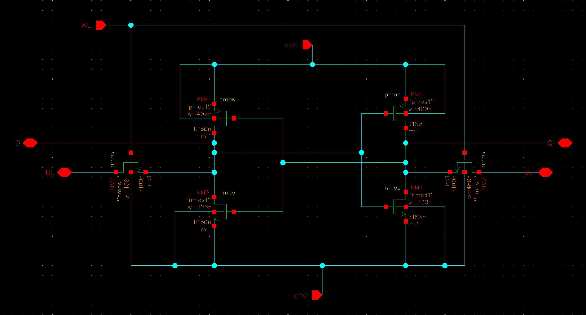
</p>


### 1. Pre-charge circuit
Pre-circuit is used to pre-charge the bit lines to Vdd before the Read
operation. It consists of: a) Equalizer transistor which reduces the
required pre-charge time by ensuring that both bit lines are at nearly
equal voltages even if they are not pre-charged to Vdd.

b\) Bias transistors that pull each of the bit lines to Vdd.

<p align="center">
  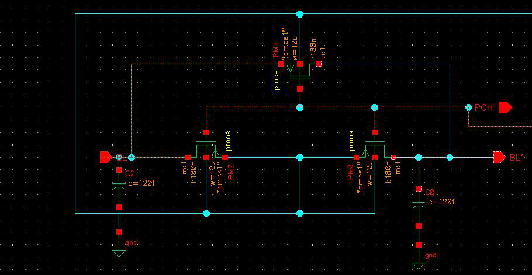
</p>

### 2. Isolation circuit
Isolation circuit is used to isolate the sense amplifier from the bit
lines once a small change on the bit lines is detected.

<p align="center">
  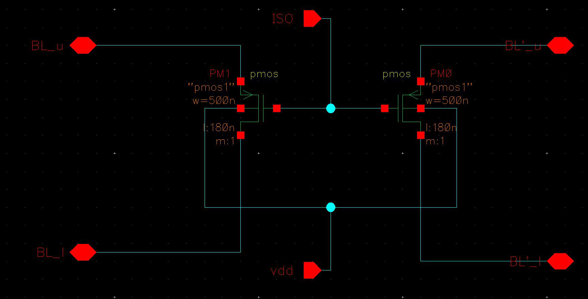
</p>


## 3.Sense Amplifier
The sense amplifier is responsible for detecting the value stored in the
SRAM cell during the read operation and displaying that value at the
output.

<p align="center">
  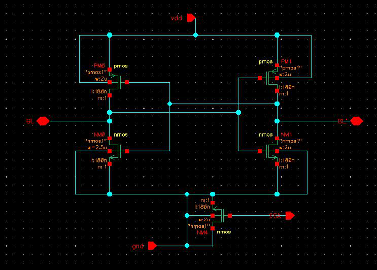
</p>


### 4. Write driver circuit
The write driver circuit is responsible for writing the data onto the bit lines
BL and BL' during the write operation

<p align="center">
  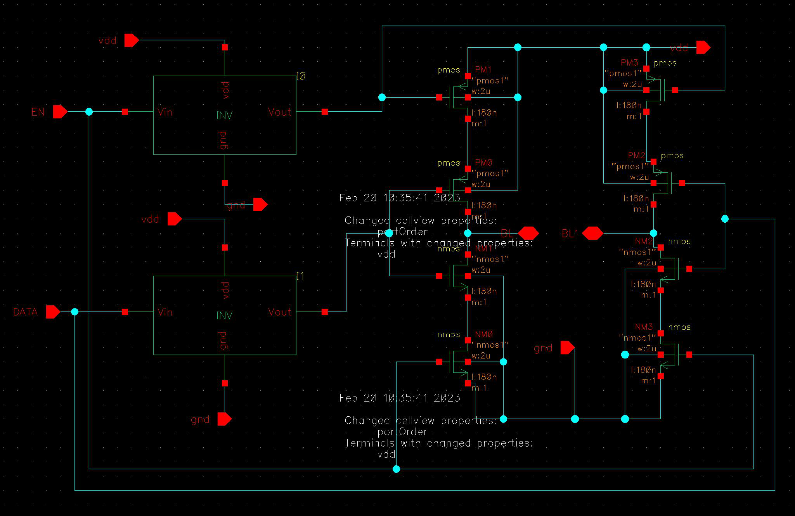
</p>


### 5.SRAM cell along with all the peripheral devices


<p align="center">
  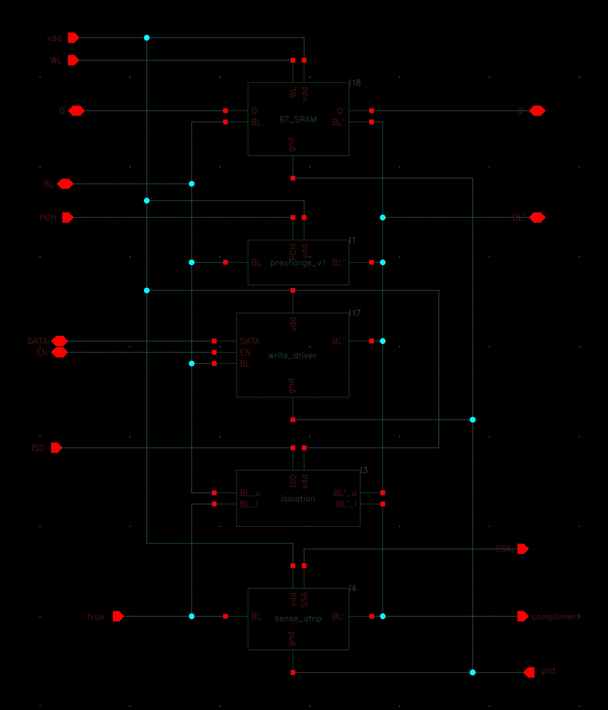
</p>

Timing diagram (Wrtie 1 followed by read 1, write 0 followed by read 0 )

<p align="center">
  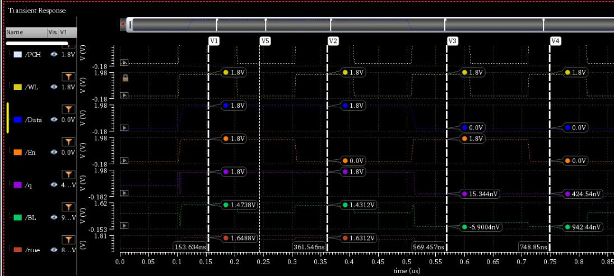
</p>


**Q. Simulate read operation and Find the time it takes to generate 200 mV sense margin ( difference in voltage between BL and BL' after WL is  made HIGH)**

<p align="center">
  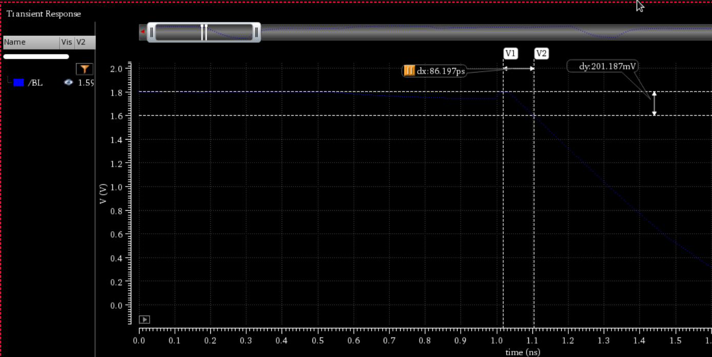
</p>

**Q. Simulate the write operation and Find the time it takes to generate the data to be written on BL and BL'**
Ans: The circuit took 0.5249ns to generate the data to be written I.e to bring changes on BL and BL'

<p align="center">
  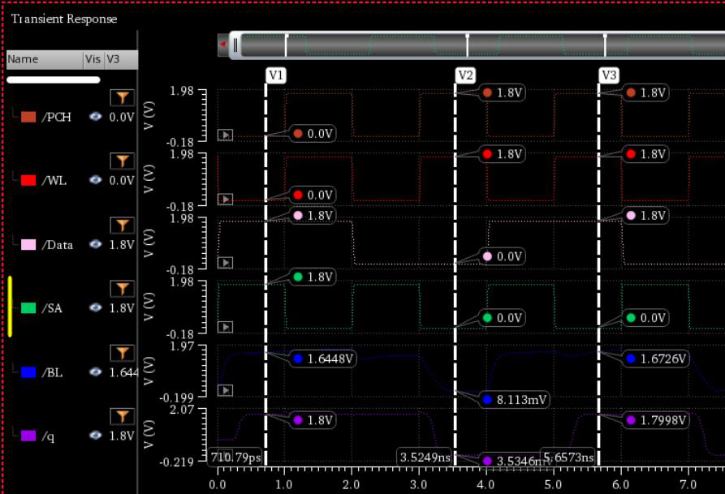
</p>


### 4x4 memory array
**Finally, we have designed a 4X4 memory array and performed the write and read operation on a cell**

<p align="center">
  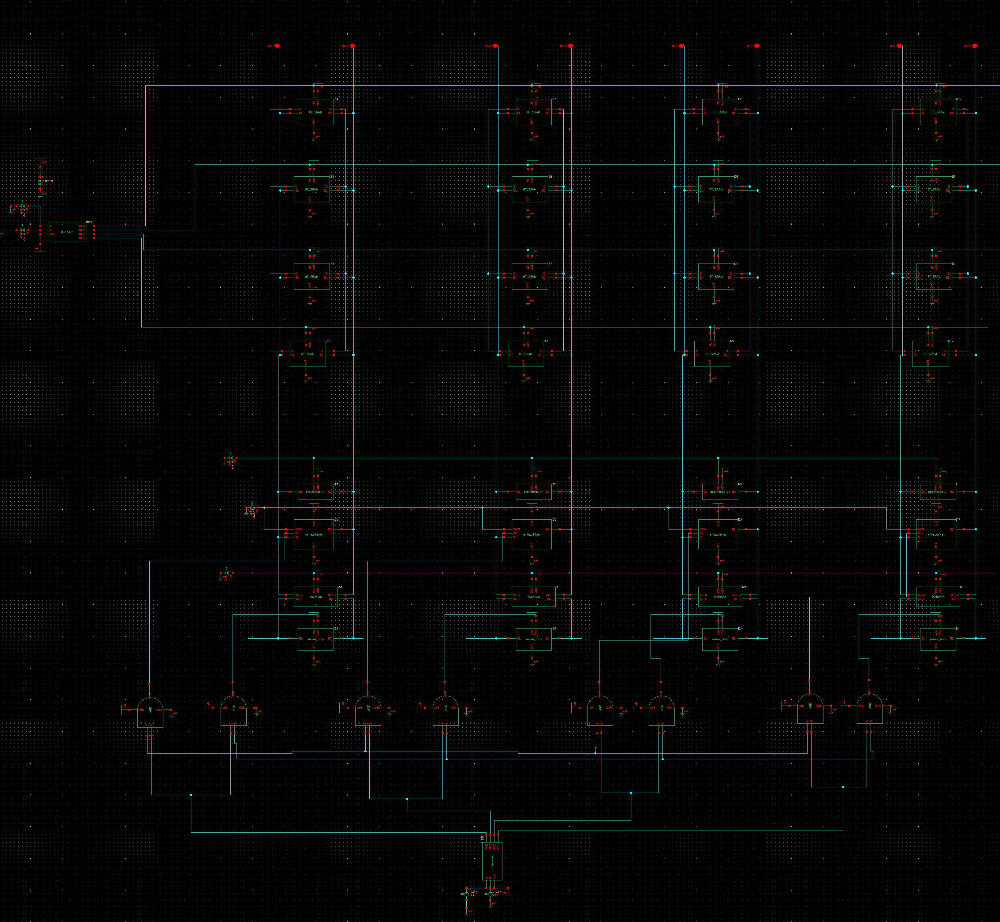
</p>


## Conclusion :
 In our project, we have a 6T SRAM cell along with its peripherals (Pre-charge circuit, Isolation Circuit, Sense amplifier and Write driver circuit) using GPDK 180 nm technology. We have measured the Static Noise margin for the Hold  state and Read state of the SRAM cell. We have finally designed a 4x4 Memory array and have performed the Write and Read operation on each cell

## Acknowledgment

I would like to express my sincere gratitude to Prof. Mahesh Awati for his exceptional teaching and guidance throughout the course. His support and assistance with all the lab work have been invaluable. Also, I would like to thank **PES University** for providing us with all the necessary infrastructure to this project a possibility. 

 
